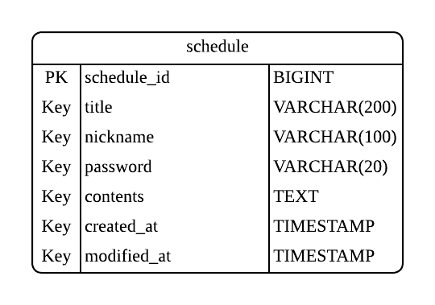

# 일정 관리 앱

## 프로젝트 소개
사용자가 일정을 생성/조회/수정/삭제할 수 있는 간단한 일정 관리 앱입니다.

## 기술 스택
- Java
- Spring Boot
- Lombok
- Spring Web
- Spring Data JPA
- MySQL Driver

## 개발 도구
- Postman
- IntelliJ
- MySQL
- Lucidchart

## ERD


## API 명세서

### 1) 일정 생성 API
- URL: POST /schedules
- 설명: 일정 생성
- 인증/인가: 없음
- 데이터 형식: JSON

### Request
```json
{
   "title": "testtitle",
   "nickname": "user1",
   "password": "1234",
   "contents": "test"
}
```

### Response (성공)
```json
{
   "id": 1,
   "title": "testtitle",
   "nickname": "user1",
   "contents": "test",
   "createdAt": "2025-11-10T15:42:46.937858",
   "modifiedAt": "2025-11-10T15:42:46.937858"
}
```

### Response (실패)
```json
{
  "timestamp": "2025-11-10T11:30:18.005+00:00",
  "status": 400,
  "error": "Bad Request",
  "message": "비밀번호는 숫자만 입력 가능합니다.",
  "path": "/schedules"
}
```

### 2) 일정 조회 API
- URL: GET /schedules/{scheduleId}
- 설명: 일정 조회
- 인증/인가: 없음
- 데이터 형식: JSON

### Request
`GET /schedules/1`

### Response (성공)
```json
{
   "id": 1,
   "title": "testtitle",
   "nickname": "user1",
   "contents": "test",
   "createdAt": "2025-11-09T13:30:26.937858",
   "modifiedAt": "2025-11-09T13:30:26.937858"
}
```

### Response (실패)
```json
{
  "timestamp": "2025-11-12T06:53:18.839+00:00",
  "status": 500,
  "error": "Internal Server Error",
  "message": "없는 일정입니다.",
  "path": "/schedules/1"
}
```

### 3) 일정 전체 조회 API
- URL: GET /schedules
- 설명: 일정 전체 조회
- 인증/인가: 없음
- 데이터 형식: JSON

### Request
`GET /schedules`

### Response
```json
[
  {
    "id": 2,
    "title": "testtitle2",
    "nickname": "user2",
    "contents": "test",
    "createdAt": "2025-11-10T15:42:46.937858",
    "modifiedAt": "2025-11-10T15:42:46.937858"
  },
  {
    "id": 1,
    "title": "testtitle",
    "nickname": "user1",
    "contents": "test",
    "createdAt": "2025-11-09T13:30:26.937858",
    "modifiedAt": "2025-11-09T13:30:26.937858"
  }
]
```

### 4) 일정 수정 API
- URL: PUT /schedules/{scheduleId}
- 설명: 일정 수정
- 인증/인가: 없음
- 데이터 형식: JSON

### Request
```json
{
  "title": "modifiedtitle",
  "nickname": "user3",
  "password": "1234"
}
```
### Response (성공)
```json
{
   "id": 1,
   "title": "modifiedtitle",
   "nickname": "user3",
   "contents": "test",
   "createdAt": "2025-11-09T13:30:26.937858",
   "modifiedAt": "2025-11-11T09:50:10.937858"
}
```

### Response (실패)
```json
{
  "timestamp": "2025-11-12T06:47:22.454+00:00",
  "status": 500,
  "error": "Internal Server Error",
  "message": "없는 일정입니다.",
  "path": "/schedules/1"
}
```
```json
{
"timestamp": "2025-11-12T06:56:25.545+00:00",
"status": 400,
"error": "Bad Request",
"message": "비밀번호를 다시 입력해주세요.",
"path": "/schedules/2"
}
```

### 5) 일정 삭제 API
- URL: DELETE /schedules/{scheduleId}
- 설명: 일정 삭제
- 인증/인가: 없음
- 데이터 형식: JSON

### Request
```json
{
  "password": "1234"
}
```

### Response (성공)
```json
{
  (없음)
}
```

### Response (실패)
```json
{
  "timestamp": "2025-11-12T06:58:10.669+00:00",
  "status": 500,
  "error": "Internal Server Error",
  "message": "없는 일정입니다.",
  "path": "/schedules/1"
}
```
```json
{
"timestamp": "2025-11-12T06:58:41.793+00:00",
"status": 400,
"error": "Bad Request",
"message": "비밀번호를 다시 입력해주세요.",
"path": "/schedules/2"
}
```

## 클래스 구조
- `Schedule` : 일정 엔티티
- `BaseEntity` : 생성 시간과 수정 시간을 자동으로 관리해주는 공통 엔티티
- `ScheduleController` : API 요청, 응답 처리
- `ScheduleService` : 비즈니스 로직 수행
- `ScheduleRepository` : DB 연동
- `ScheduleRequestDto` / `ScheduleResponseDto` : API 요청, 응답에 필요한 DTO 관리

## 주요 기능
- 일정 생성
- 일정 단건 조회
- 일정 전체 조회
- 일정 수정
- 일정 삭제

## 느낀점
- 처음으로 CRUD 과제를 수행해보면서 CRUD의 흐름을 자연스럽게 익힐 수 있었다. 특히 클래스를 어떻게 분리해야 하는지, 어떤 어노테이션을 붙여야 하는지에 대해서 감을 잡을 수 있었다.
엔티티, DTO, 3계층의 역할에 대해서도 더 잘 이해할 수 있었다. 이번 과제에서 이해한 것을 바탕으로 다음 과제에서는 더 능숙하게 CRUD를 다룰 수 있을 것 같다.